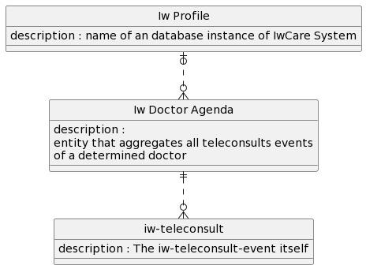

# IW-Telemedicina-API Documentação  

## Introdução
>Este projeto tem como objetivo integrar o Sistema de Saúde IwCare da Incoway Inc. e os recursos do Google Meeting no Google Workspaces por meio de sua API de Calendário.  
A integração foi implementada usando o Google App Script que tem uma grande afinidade com o Google-Calendar-API (que na verdade pertence ao Google-Meeting-Resource para videoconferências).  
Esta integração oferecerá ao Sistema IwCare as consultas de telemedicina integrando-o com excelente aplicativo de videoconferência do Google Meeting.  
Esse tipo de abordagem abstrai toda a complexidade relacionada ao padrão WebRTC e sua infraestrutura (Signaling, Stun and Turn servers), sem falar no aplicativo GUI que deve ser escrito para orquestrar tudo isso e oferecer ao usuário final uma boa experiência de uso. Acrescentando de que este App deve ser executado em diferentes plataformas (ios, android, windows, macOS, linux,...) com diferentes tamanhos de tela.
E  lista de detalhes que devem ser considerado não para ...  
  
A plataforma Google App Scripts tem 2 objetos javascript pré-configurados: CalendarApp e Calendar. Usando esses 2 objetos, é possível executar processos complexos com poucas linhas de código. Esses 2 objetos têm alguma sobreposição de funcionalidades, onde é possível implementar um recurso com ambos. Dependendo do que se deseja fazer, deve-se optar pelo objeto onde a implementação seja mais simples. 

## Instação e Atualização:  

[Procedimento de instalação - Português Brasileiro](installing-iw-telemedicine-in-clients-lang-pt.md)

[Procedimento de atualização - Português Brasileiro](updating-iw-telemecine-in-clients-lang-pt.md)
  
## Algumas informações sobre o projeto


### formato de data e hora
Como JSON não tem uma forma padrão de passar Datas, aqui vamos usar o formato que o Google definiu para esse objetivo.
Sempre que passarmos / recebermos uma Data, usaremos strings - formato abaixo:

Formato para datas:

YYYY-MM-DDThh:mm:ss-hh:mm

ou

YYYY-MM-DDThh:mm:ss+hh:mm

onde:

YYYY = um ano de quatro dígitos

MM = um mês de dois dígitos, de 01 a 12

DD = um dia do mês de dois dígitos, de 01 a 31

T = um valor literal que segue a data e introduz a hora

hh = dois dígitos para a hora, de 00 a 23

mm = dois dígitos para os minutos, de 00 a 59

ss = dois dígitos para os segundos, de 00 a 59

TZD = designador de fuso horário (Z ou +hh:mm ou -hh:mm)
Z para horário UTC

onde +hh:mm para um fuso horário local que está à frente do UTC

onde -hh:mm para um fuso horário local que está atrás do UTC

Exemplo:
2022-05-14T22:59:59-03:00  

Significado: Dia 14 de maio (mês) de 2022 (ano) às 22 horas e 59 minutos e 59 segundos, fuso horário -03:00 (fuso horário de São Paulo ou Brasília)


### Modelo lógico de dados
> Do ponto de vista do IwCare, foram utilizadas 3 entidades:  
>
>

>1. IW-PROFILE: tecnicamente é o nome da instância do banco de dados do Sistema IWCare. Do ponto de vista do Google workspace, é apenas um PREFIXO do nome de um calendário. Todos os nomes de calendário serão formados usando esta regra de formato: <IW-PROFILE>-Dr-<iwProfessionalId>. Exemplo: para um médico que tem iwProfessionalId = 1234  na instância do banco de dados IwIncoway, ele terá sua Agenda (calendário) com o nome: IwIncoway-Dr-1234  
>2. IW-AGENDA: tecnicamente esta entidade não existe nativamente no Sistema IwCare. Criamos este conceito aqui mesmo. Tem uma correspondência de 1 para 1 com o objeto Calendário dentro do Google workspaces.  
>3. IW-TELE-CONSULT: tecnicamente esta entidade é chamada simplesmente de Consulta. Tem uma tabela de banco de dados chamada Consulta e cada uma tem um ID (consultId) como chave primária. Do ponto de vista do google workspaces, IW-CONSULT tem correspondência de 1 para 1 com o evento de calendário com um link de hangout atribuído a ele  
>4. Essa tabelas não existem em nenhum banco de dados (nem no modelo do IwCare nem no Google Workspaces explicitamente). São apenas conceitos criados aqui para facilitar o entendimento.
> Nâo existe limite teórico para o número de Agendas que podem existir na conta de um único Usuário do Google Workspaces.   
Podendo ir de dezenas, centanas ou até mesmo milhares. Mas em termos práticos deve-se observar a responsividade da API de modo a contribuir para tempos de responta satisfatórios. Caso um dados cliente tenha milhares de profissionais que terão agendas de teleconsultas, deve-se considerar a possibilidade de criar mais do que 1 usuário para esses clientes e dividir a carga de agendas entre as duas contas. Sendo que do ponto de vista do Google Workspaces, para cada usuário ativo, é adicionado um custo de aproximadamente $US 5 a $US 7 por mês para contas do tipo *Business Starter.*  
Mas para a maioria dos clientes da Iberwan, um único usuário do Google Workspaces é o suficiente.    


### Essência
>A essência dessa integração é oferecer uma URL para uma determinada sala de reunião do Google Meeting. A única tarefa que o Sistema IwCare precisa fazer é colocar 2 usuários finais apontando para a mesma URL em um navegador.  
Fazendo isso, eles farão uma videoconferência.  

### Implementação
Cada vez que instalamos ou publicamos uma nova versão do IW-Teemedicine-API no Google Works Spaces, é gerada uma nova URL de acesso a API.  
Essa URL é a mesma para todas as funcionalidades.  
Chamamos ela de URL base. Cada implantação específica do Iw-Telemedicine-API só aceitará requisições dessa URL base gerada especificamente para ela.  

### URL base do IW-Telemedicine-API;
Apenas a título de exemplo, aqui está uma URL base típica do IW-Telemedicine-API.  
Ela não funciona. É apenas um exemplo:  
```text
https://script.google.com/macros/s/AKfycbyr7gqRjEUjHdlHJe6QDDhGS-Ui5TcnaK6lvki4YmAtE1wch2fUNzbcEzZPHVG5snQK/exec  
```  

### Arquitetura Severless
Este projeto usa abordagem SERVERLESS. Isso significa que o Google fornece toda a infra-estrutura para processar e escalar todos os HTTP-POST-REQUESTS que chegam à URL base.  

*IMPORTANTE:*  
**Esta URL base sempre muda quando um novo projeto é implantado. Ou seja quando é instalado/atualizado.**
Prestar muita atenção nisso.  
  
>Diferentes ações podem ser acessadas usando a mesma URL BASE, e passando os parâmetros corretos no corpo de cada requisição HTTP POST.
Somente requisições HTTP POST são aceitas.  
Requisições HTTP GET não serão respondidas.
Todas requisições devem ter no seu corpo um atributo chamado "action" que identifica a ação que queremos executar e   
os demais parametros associados a cada ação.

Esta primeira versão implementa 8 "actions":

getVersion  
getAllAgendas  
createIwAgenda  
delIwgAgenda  
createIwTeleconsult  
createIwTeleconsultUsingCalendar  
IddelIwTeleconsult  
recreateProfessionalAgenda  
  
Para executar qualquer uma dessas ações, é necessário acessar a URL base padrão, passando no corpo da requisição POST, um objeto JSON com todos os parâmetros necessários a respectiva ação. Somente requisições HTTP POST são aceitas. Requisições GET não serão respondidas. como também nenhum outro método HTTP é aceito.  

Cada ação tem atributos específicos. Seu próprio objecto JSON (payload). E cada resposta tem também sua própria estrutura (repsonse payload).  

  
  
