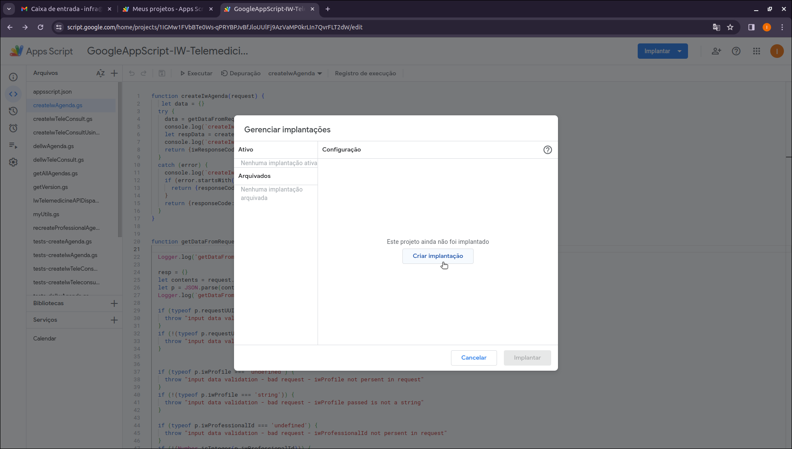

# Etapa 3  
## Instalação IW-Telemedicina-API
  

Executada usando o IDE do Google para App Scripts que funciona direto do Navegador (Google Chrome de preferência)  
*Esses passos devem ser executados pelo cliente, com suporte de um consultor da Iberwan se o cliente assim o desejar.*
  
>Essensialmente, os passos abaixo irão realizar todas as autorizações de execução dos scripts como se fossem dispadodos pelo usuário da respectiva conta (<nome_cliente@iwsoftware.com.br>),
permitindo que os scripts do projeto carregados na etapa anterior sejam acessados na internet e também tenham acesso aos recursos necessários do Google Workspace.  
Essas autorizações são *essenciais* para que o projeto funcione e sejam acessados via internet.  
Além disso, será definida uma propriedade de projeto que será usada para validar a URL usada em todos as requisições HTTP
para a instância do IW-Telemedicina instalada no cliente  

Seguem os passos:  


1. **implantar o projeto:**  
Ao executar o ultimo passo da etapa anterior estaremos com o Navegador aberto no projeto do IW-Telemedicine-API carregado no Google Workspace do usuário infra correspondente.
Clicar no botão *implantar (deploy)* e selecione a opção *manage deployments (gerenciar implantações)*    
em seguida aparecerá a caixa de Diálogo abaixo:
  
Na sequencia aparecerá a tela abaixo:  
  
Aqui pressione o botão: *create Deployment (criar Implantação)*  
Na sequencia aparecerá a tela abaixo:  

Na sequencia aparecerá a tela abaixo:  

**WIP - work in progess here ...**

Ao final da implantação (Deployment), aparecerá a tela abaixo:  
  

Essa tela oferece a possibilidade de copiar a URL de acesso a aplicação instalada.  
**IMPORTANTE:**   
**Todas as vezes que se instala ou atualiza o IW-Telemedicine-API, a URL base de acesso é alterada.**  

**Essa URL deve ser copiada e salva em uma propriedade de ambiente do projeto chamada: AUTHORIZED_URL (veja próximo passo).**  

2. **criar uma propriedade de projeto chamada: AUTHORIZED_URL**  
Clicar na opção configurações (Settings) localizada do lado esquerdo do IDE.
Rolar a tela (para baixo) até encontrar a opção: *script properties (propriedades do script)*
Adicionar uma nova propriedade chamada: AUTHORIZED_URL e atribuir o valor da URL copiada da etapa anterior.  
Prestar muita atenção na digitação do nome da propriedade, com todas as letras maiúsculas.

Essa propriedade será usada para validar a URL usada em todas as requisições HTTP para esta instância do IW-Telemedicina-API que acaba de ser instalada.  
**È muito importante que essa propriedade seja corretamente valorada.**  
*Sem essa propriedade corretamente valorada, o IW-Telemedicina-API rejeitará todas as chamadas.*

3. **Fazer um test de chamada a API:**  
fazer um teste de chamada a API do Iw-Telemedicina.
use o seguinte commando linux:  
```bash  
curl -X POST -H "Content-Type: application/json" -d '{"action":"getVersion","requestUUID":"123e4567-e89b-12d3-a456-426614174000"}' URL_DO_IW-TELEMEDICINE-API
```  
A resposta deve ser algo como:  
```json  

```  


**WIP - Edição desse Documento em progresso...**  

>Agora siga para a Etapa 4 da instalação do IW-Telemedicine-API:  
[Etapa 4](installing-iw-telemedicine-in-clients-iwcare-config-lang-pt.md)

