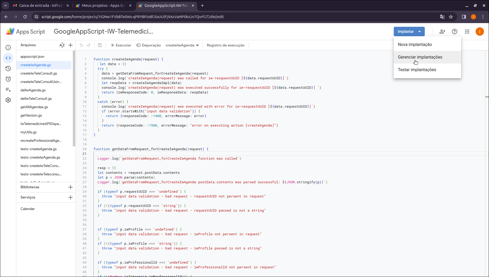
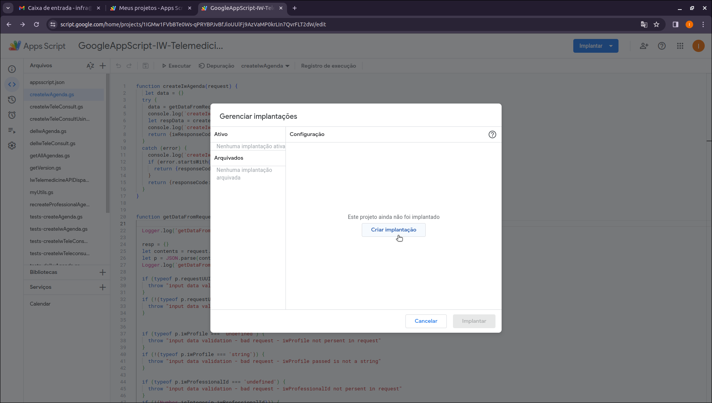
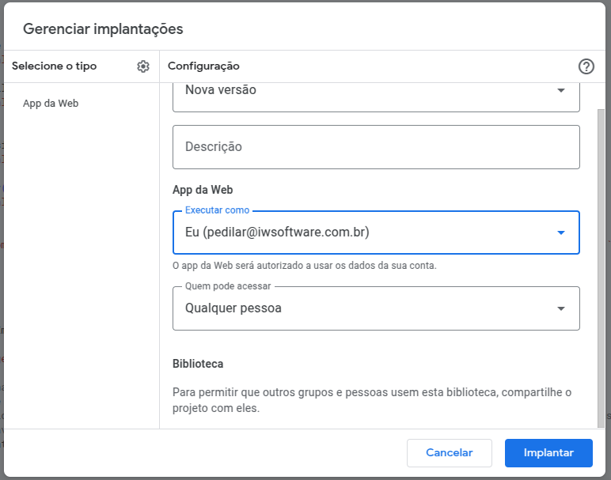
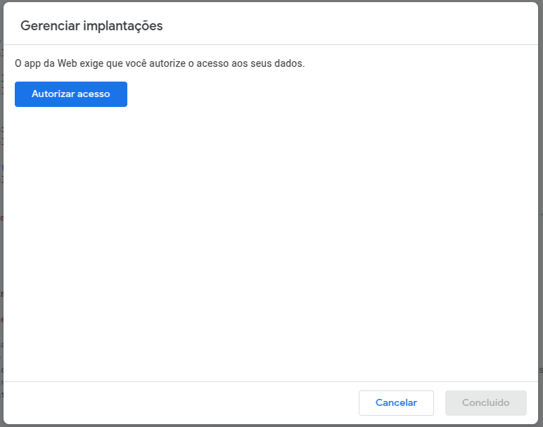
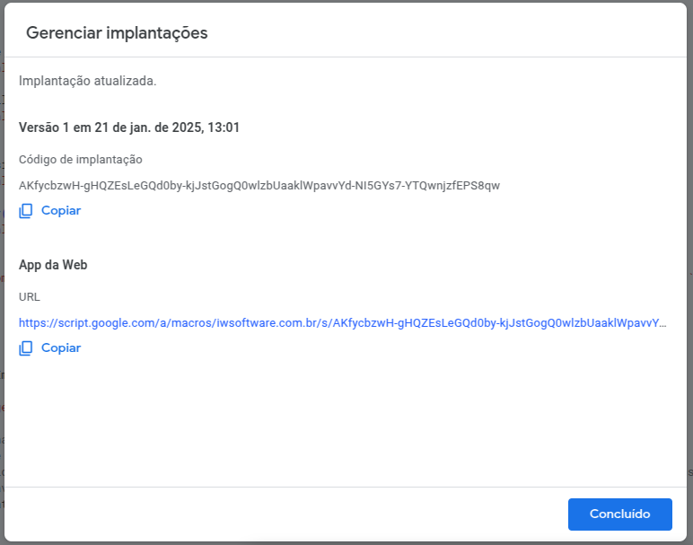

# Etapa 3  
## Instalação IW-Telemedicina-API
  
Executada usando o IDE do Google para App Scripts que funciona direto do Navegador (Google Chrome de preferência)  
*Esses passos devem ser executados pelo cliente, com suporte de um consultor da Iberwan se o cliente assim o desejar.*
  
>Essensialmente, os passos abaixo irão realizar todas as autorizações de execução dos scripts como se fossem dispadodos pelo usuário da respectiva conta (<nome_cliente@iwsoftware.com.br>),
permitindo que os scripts do projeto carregados na etapa anterior sejam acessados na internet e também tenham acesso aos recursos necessários do Google Workspace.  
Essas autorizações são *essenciais* para que o projeto funcione e sejam acessados via internet.  
Além disso, será definida uma propriedade de projeto que será usada para validar a URL usada em todos as requisições HTTP
para a instância do IW-Telemedicina instalada no cliente  

Seguem os passos:  

## 1. **implantar o projeto:**  
Ao executar o ultimo passo da etapa anterior estaremos com o Navegador aberto no projeto do IW-Telemedicine-API que acaba de ser carregado.  
Clicar no botão azul *implantar (deploy)* localizado no topo do IDE e selecione a opção *gerenciar implantações (manage deployments)*:  
  
Na sequencia aparecerá a tela abaixo:  
  
Aqui pressione o botão: *create Deployment (criar Implantação)*  
Na sequencia aparecerá a tela abaixo:  
  
Presione o botão *Implantar (Deploy)*  
Na sequencia aparecerá a tela abaixo:  
  
Clique no botão azul *Autorizar Acesso*.
Agora, uma série de telas associadas ao processo de autorização irão se suceder.
Não vamos mostrar aqui todas essas telas de autorização porque a aparência delas muda com frequência.
O Google está sempre mexendo nessas telas. Segurança é uma questão levada muito a sério.  
**O importante é autorizar tudo o que for perguntado.**  

Ao final da implantação, aparecerá a tela abaixo:  
  

Essa tela oferece a possibilidade de copiar a URL BASE de acesso à aplicação.  
Essa URL é muito importante e deve ser guardada. Será usada em passos subsequentes.  
Não se preocupe caso não tenha salvo essa URL BASE. O IDE do Google App Scripts oferece recursos de consultar esse dado sempre que se desejar.   
  
**IMPORTANTE:**   
**Todas as vezes que se instala ou atualiza o IW-Telemedicine-API, é criada uma nova URL BASE**  

## 2. Criar uma propriedade de projeto chamada: *AUTHORIZED_URL*  
Para tal, clicar na opção configurações (Settings) localizada do lado esquerdo do IDE.
Rolar a tela (para baixo) até encontrar a opção: *script properties (propriedades do script)*
Adicionar uma nova propriedade chamada: AUTHORIZED_URL e atribuir inicialmente um valor aleatório qualquer. Ex: abdefg  
Essa propriedade será usada para validar a URL usada em todas as requisições HTTP para esta instância que acaba de ser instalada.  
Para efeito de TESTES ela foi inicializada com valor incorreto de propósito.

## 3. Fazer TESTES de chamadas da API:  
### inicialmente sem valor correto da URL BASE na propriedade AUTHORIZED_URL  

Fazer 3 testes usando os comandos abaixo.  
Cada teste usa uma linguagem de programação distinta para fazer a chamada.  
Garantem independência tecnológica dos serviços de telemedicina e também o funcionamento da proteção de aceite apenas de chamadas que usam
a URL BASE certa.
Nesses testes o IW-Telemedicine-API rejeitará as chamadas, uma vez que a propriedade AUTHORIZED_URL foi inicialmente valorada com valor aleatório e portanto incorreto.  
**Esses testes são vitais para garantir que API está acessivel somente aos que sabem chamá-la de fato. E independente da tecnologia usada na chamada.**  
A sequir os comandos que devem ser usados nesses testes.  

**Linguagem Python 3.10:**  
```bash  
python3 test-iw-telemedicine-api-call.py URL_BASE_CORRETA
```  
>Nesse comando deve-se substituir *URL_BASE_CORRETA* da instalação, salva no final do passo 1.

A resposta deve ser:  
```json  

```

---  

**Linguagem Java 8:**  
```bash  
java (WIP...) URL_BASE-CORRETA
```  
>Nesse comando também deve-se substituir *URL_BASE_CORRETA* da instalação, salva no final do passo 1.
**A resposta deve ser a mesma da chamda feita em Python.**  

---  

**Linguagem Golang 1.21:**  
```bash  
test-iw-telemecine-api URL_BASE_CORRETA
```  
>Nesse comando também deve-se substituir *URL_BASE_CORRETA* da instalação, salva no final do passo 1.  
**A resposta deve ser a mesma da chamda feita em Python.**  


## 4. Fazer TESTES de chamadas da API:  
### Agora com o valor correto da URL BASE na propriedade AUTHORIZED_URL  

>Agora vamos acessar a Propriedade AUTHORIZED_URL via IDE do mesmo modo que fizemos no momento da criação dela no passo 2.
Vamos valorar corretamente a propriedade com a URL BASE Obtida no final do passo 1.
** Importante valorar essa propriedade com o valor exato. Trata-se de valor com muitos caracteres. Evite digitação. Use copiar e colar.**  

repetir os mesmos comandos usados no passo 3.  
Agora, nesses testes o IW-Telemedicine-API aceitará as chamadas, uma vez que a propriedade AUTHORIZED_URL agora está com o valor correto.  

A sequir os comandos que devem ser usados nesses testes.  

**Linguagem Python 3.10:**  
```bash  
python3 test-iw-telemedicine-api-call.py URL_BASE_CORRETA
```  
>Nesse comando deve-se substituir *URL_BASE_CORRETA* da instalação, salva no final do passo 1.

A resposta deve ser:  
```json  

```

---  

**Linguagem Java 8:**  
```bash  
java (WIP...) URL_BASE-CORRETA
```  
>Nesse comando também deve-se substituir *URL_BASE_CORRETA* da instalação, salva no final do passo 1.
**A resposta deve ser a mesma da chamada em Python.**  

---  

**Linguagem Golang 1.21:**  
```bash  
test-iw-telemecine-api URL_BASE_CORRETA
```  
>Nesse comando também deve-se substituir *URL_BASE_CORRETA* da instalação, salva no final do passo 1.  
**A resposta deve ser a mesma da chamada em Python.**  


Agora siga para a Etapa 4: [Etapa 4](installing-iw-telemedicine-in-clients-iwcare-config-lang-pt.md)  

